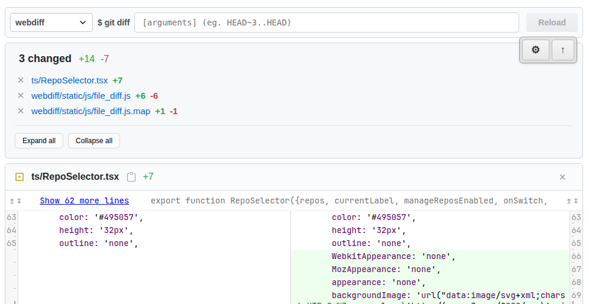

# git-webdiff

A web-based git diff server with hot reload and multi-file view. Forked from [danvk/webdiff](https://github.com/danvk/webdiff).

git-webdiff runs as a persistent server that manages its own `git difftool` process, allowing changes to git diff arguments on-the-fly from the browser.

This tool was created with AI workflows in mind. Start the git-webdiff server and inspect changes made to the codebase:

1. **Review all changes at once** - See every modified file in a single scrollable view without switching between files or repeatedly running `git diff`
2. **Hot reload between iterations** - Change git arguments to compare different stages of generated changes
3. **Watch mode for live updates** - As files are modified, get notified instantly

[](webdiff-example.png)

## Features

- 📁 **Multi-file view** - See all changed files in one scrollable page
- 🗂️ **Multi-repository support** - Compare diffs from multiple repos in one session
- ⚙️ **Dynamic repo management** - Add, edit, remove, and reorder repositories from the UI (with `--manage-repos` flag)
- 🔄 **Hot reload** - Change git arguments from the UI without restarting
- 👁️ **Watch mode** - Automatically detect when diff changes on disk
- 🎨 **Syntax highlighting** - Multiple color themes
- 🖼️ **Image diffs** - Side-by-side image comparison
- ⌨️ **Keyboard shortcuts** - Navigate diffs efficiently
- 🚀 **Performance optimizations** - Gzip compression, smart caching, no-diff pre-checking

## Requirements

- [uv](https://github.com/astral-sh/uv) - Python package installer and runner

## Installation

```bash
git clone <this-repo>

# Add to your PATH
ln -s "$(pwd)/git-webdiff/git-webdiff.sh" /usr/local/bin/git-webdiff
```

## Usage

### Basic Usage

Starts a local web server and opens your browser. The git arguments are initial values that can be changed from the browser UI.

```bash
# Compare working directory with HEAD
git-webdiff

# Compare specific commits
git-webdiff HEAD~3..HEAD

# Compare branches
git-webdiff main..feature-branch

# Compare staged changes
git-webdiff --cached

# Compare specific files
git-webdiff -- path/to/file.txt

# Compare with path filter
git-webdiff HEAD~5..HEAD -- src/
```

The server runs until stopped (Ctrl+C) or the timeout expires (if set with `--timeout`).

### Server Options

```bash
# Use custom port
git-webdiff --port 8080

# Use custom theme (googlecode, monokai, github, etc.)
git-webdiff --theme monokai HEAD~3..HEAD

# Disable watch mode (won't auto-detect changes)
git-webdiff --no-watch

# Set custom watch interval (default: 10 seconds)
git-webdiff --watch 5 HEAD~3..HEAD

# Set server timeout (auto-shutdown after N minutes)
git-webdiff --timeout 30

# Repository management is enabled by default for localhost
git-webdiff

# Explicitly disable repository management (even on localhost)
git-webdiff --no-manage-repos
```

### Available Options

Run `git-webdiff --help` or `uv run -m webdiff.app --help` for full option list:

```
--port PORT, -p PORT          Port to serve on (default: random)
--host HOST                   Host to serve on (default: localhost)
--theme THEME                 Color theme (default: googlecode)
--watch SECONDS               Auto-reload interval (default: 10)
--no-watch                    Disable watch mode
--timeout MINUTES             Auto-shutdown timeout (default: 0 = disabled)
--max-diff-width WIDTH        Maximum diff width (default: 160)
--unified LINES               Context lines (default: 8)
--diff-algorithm ALGORITHM    Diff algorithm: myers, minimal, patience, histogram
--manage-repos                Enable dynamic repository management from UI (default for localhost)
--no-manage-repos             Disable dynamic repository management from UI
```

### Hot Reload Feature

The server includes a command bar at the top that lets you change git arguments without restarting:

1. Start the server: `git-webdiff`
2. In the browser, edit the git arguments in the command bar
3. Press Enter or click "Reload"
4. View the new diff instantly

Example workflow:
```bash
# Start with no args (compares working dir with HEAD)
git-webdiff

# In browser, change to "HEAD~5..HEAD"
# Press Enter → see last 5 commits

# Change to "--cached"
# Press Enter → see staged changes
```

### Watch Mode

By default, webdiff watches for changes to the underlying diff and notifies you in the browser:

```bash
# Watch with default 10-second interval
git-webdiff

# Watch with custom interval
git-webdiff --watch 5

# Disable watching
git-webdiff --no-watch
```

When watch mode detects changes, a reload button appears in the UI.

### Multi-Repository Support

Compare diffs from multiple repositories in a single webdiff session. Switch between repos using the dropdown selector in the UI.

```bash
# Compare two repos with custom labels
git-webdiff \
  --git-repo frontend:/path/to/frontend-repo \
  --git-repo backend:/path/to/backend-repo

# Compare repos (labels auto-generated from directory names)
git-webdiff \
  --git-repo /path/to/frontend \
  --git-repo /path/to/backend

# Compare multiple packages in a monorepo
git-webdiff \
  --git-repo ui:/workspace/packages/ui \
  --git-repo api:/workspace/packages/api \
  --git-repo shared:/workspace/packages/shared \
  --watch 5
```

**Features:**
- Each repo has its own independent diff state
- Switch between repos without restarting the server
- Watch mode works independently for each repo
- URLs are bookmarkable per repo (e.g., `http://localhost:8000/?repo=frontend`)
- Open multiple browser windows, one for each repo

**Label syntax:**
- With label: `--git-repo label:/path/to/repo`
- Without label: `--git-repo /path/to/repo` (uses directory basename as label)
- Duplicate labels are automatically made unique (`app`, `app-1`, `app-2`, etc.)

### Dynamic Repository Management

With the `--manage-repos` flag, you can add, edit, remove, and reorder repositories from the web UI without restarting the server:

```bash
# Start with dynamic management enabled
git-webdiff --manage-repos --git-repo frontend:/path/to/frontend

# In the browser:
# 1. Click the repo selector dropdown
# 2. Select "Manage repos..." from the bottom
# 3. Add, edit, remove, or reorder repositories
# 4. Click "Apply" to update the server
```

**Features:**
- **Add repos** - Add new repositories with custom labels and paths
- **Edit repos** - Change labels or paths of existing repositories
- **Remove repos** - Remove repositories from the list
- **Reorder repos** - Drag to reorder (using ↑/↓ buttons)
- **Validation** - All repos are validated before applying changes:
  - Must be absolute paths
  - Must be git repositories (contain `.git` directory)
  - No duplicate labels or paths allowed
- **Apply/Cancel workflow** - Changes are staged locally until you click "Apply"
- **Atomic updates** - All repos are updated atomically with rollback on error
- **No persistence** - Changes are lost when server restarts

**Important notes:**
- Changes are **not persisted** across server restarts - you need to update your command-line arguments for permanent changes
- Removing the currently viewed repo will redirect to the first repo in the list
- At least one repository must remain in the list

#### Security Considerations

Repository management has important security implications:

**Default behavior:**
- **Localhost (default)**: Repository management is **enabled by default**
  - Safe for local development
  - No need to specify `--manage-repos` flag
- **Non-localhost** (e.g., `--host 0.0.0.0`): Repository management is **disabled by default**
  - Must explicitly use `--manage-repos` to enable
  - Server will warn you when disabled

**Security warning when enabled on non-localhost:**

When you use `--manage-repos` with `--host` set to a non-localhost address, any user who can connect to the server will be able to:
- Add arbitrary paths from the server's filesystem
- Read files from any git repository on the server
- See directory structure and file contents

```bash
# ✅ Safe - Localhost with repo management enabled (default)
git-webdiff

# ✅ Safe - Network host, repo management automatically disabled
git-webdiff --host 0.0.0.0

# ✅ Safe - Explicitly disable repo management on localhost (if desired)
git-webdiff --no-manage-repos

# ⚠️  DANGEROUS - Exposes filesystem to network users!
git-webdiff --host 0.0.0.0 --manage-repos
```

**Best practices:**
- Repository management is safe on `localhost` (enabled by default)
- When using `--host` for network access, repo management is automatically disabled (no flag needed)
- Use `--no-manage-repos` only if you want to explicitly disable it on localhost
- Never use `--manage-repos` with network hosts unless you have proper security measures (VPN, firewall, trusted users only)

## Advanced Usage

### Direct Python Invocation

You can also run the Python module directly:

```bash
# From any git repository
uv run -m webdiff.app --git-repo $(pwd) HEAD~3..HEAD

# From a different repository
uv run -m webdiff.app --git-repo /path/to/repo main..develop

# With custom options
uv run -m webdiff.app --git-repo $(pwd) --port 8080 --theme monokai --cached
```

### Keyboard Shortcuts

- `j` / `k` - Next/previous file
- `n` / `p` - Next/previous diff hunk
- `r` - Reload (when changes detected)
- `?` - Show keyboard shortcuts help

## Architecture

Unlike traditional git difftools that are invoked by git for each file pair, webdiff:

1. Runs as a persistent server
2. Invokes `git difftool` as a subprocess
3. Manages temporary directories created by git
4. Serves diffs via a web interface
5. Allows changing git arguments without restarting

This architecture enables features like:
- Hot reload (change git args from UI)
- Watch mode (detect when diff changes on disk)
- Multi-file view (all files in one page)
- No repeated git invocations when navigating files

## Handling Large Files

Webdiff automatically handles large/minified files:

- Lines > 500 characters trigger a warning
- You can choose to view the full content or skip it
- Prevents browser hangs from processing huge minified JavaScript files

## Comparison with Original webdiff

This fork extends [danvk/webdiff](https://github.com/danvk/webdiff) with:

- **Multi-file view** - Original showed one file at a time
- **Multi-repository support** - Compare diffs from multiple repos in one session
- **Dynamic repo management** - Add/edit/remove repos from the UI (with `--manage-repos`)
- **Hot reload** - Original required restarting to change git args
- **Watch mode** - Original didn't detect external changes
- **Server architecture** - Original was invoked per-file by git
- **Command bar UI** - Change git arguments from browser
- **File truncation** - Handles large minified files
- **Virtual scrolling** - Handle massive diffs (100k+ lines) without crashes
- **Performance optimizations** - Gzip compression, smart caching, no-diff pre-checking
- **Modern build** - Uses uv for dependency management and FastAPI backend

## Troubleshooting

### "Error: Not in a git repository"

Make sure you run `git-webdiff` from inside a git repository.

### "No differences found"

The server will still start and show a message. You can change git arguments from the command bar to view different diffs.

### Port already in use

Use `--port` to specify a different port:
```bash
git-webdiff --port 8081
```

### Browser doesn't auto-reload when files change

Make sure watch mode is enabled (it's on by default). Check the server logs for errors.

## Development

```bash
# Install dependencies
uv sync

# Run directly
uv run -m webdiff.app --git-repo $(pwd)

# Build frontend (requires Node.js)
cd ts
npm install
npm run build
```

## License

See LICENSE file.

## Credits

Forked from [danvk/webdiff](https://github.com/danvk/webdiff)
